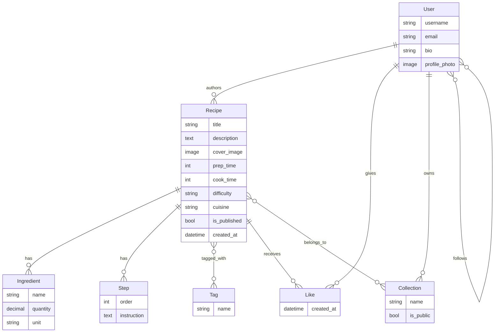

# 🍽️ RecipeShare

A full-stack recipe sharing platform where users can create, discover, and organize recipes. Built with **Django REST Framework** on the backend and a vanilla **HTML/CSS/JavaScript** frontend.

---

## ✨ Features

### 👤 User Management
- **Registration & Login** — JWT-based authentication (access + refresh tokens)
- **User Profiles** — Bio, profile photo, follower/following counts
- **Follow System** — Follow/unfollow other users (toggle endpoint)
- **Profile Editing** — Update bio and profile photo

### 🍳 Recipe Management
- **Full CRUD** — Create, read, update, and delete recipes
- **Cover Images** — Upload recipe photos (stored on Cloudinary)
- **Rich Details** — Title, description, prep time, cook time, difficulty, cuisine
- **Ingredients** — Add ingredients with name, quantity, and unit
- **Steps** — Add ordered cooking instructions
- **Tags** — Categorize recipes with tags (many-to-many)
- **Publish Control** — Draft/publish toggle for recipes

### 🔍 Discovery
- **Search** — Search recipes by title, description, tags, or ingredients
- **Feed** — Personalized feed showing recipes from followed users
- **Like System** — Like/unlike recipes (toggle endpoint with unique constraint)

### 📁 Collections
- **Create Collections** — Organize saved recipes into named collections
- **Public/Private** — Toggle collection visibility
- **Add Recipes** — Add any recipe to your collections

### 📖 API Documentation
- **Swagger UI** — Interactive API docs at `/api/docs/`
- **OpenAPI Schema** — Auto-generated schema at `/api/schema/`

---

## 🏗️ Tech Stack

| Layer        | Technology                                                     |
| ------------ | -------------------------------------------------------------- |
| **Backend**  | Python, Django 6.0, Django REST Framework 3.17                 |
| **Auth**     | Simple JWT (access + refresh tokens)                           |
| **Database** | SQLite (development)                                           |
| **Storage**  | Cloudinary (media/image uploads)                               |
| **API Docs** | drf-spectacular (Swagger / OpenAPI 3.0)                        |
| **Filtering**| django-filter                                                  |
| **CORS**     | django-cors-headers                                            |
| **Frontend** | Vanilla HTML, CSS, JavaScript                                  |

---

## 📁 Project Structure

```
Recipe-Share/
├── recipeshare/              # Django project config
│   ├── settings.py           # Settings (JWT, Cloudinary, DRF, etc.)
│   ├── urls.py               # Root URL config
│   ├── wsgi.py
│   └── asgi.py
│
├── users/                    # Users app
│   ├── models.py             # Custom User model (AbstractUser)
│   ├── views.py              # Register, Profile, Follow, UpdateProfile
│   ├── serializers.py        # RegisterSerializer, UserProfileSerializer
│   └── urls.py               # /api/users/* routes
│
├── recipes/                  # Recipes app
│   ├── models.py             # Recipe, Tag, Ingredient, Step, Like, Collection
│   ├── views.py              # RecipeViewSet, CollectionViewSet
│   ├── serializers.py        # Nested serializers (ingredients, steps, tags)
│   ├── urls.py               # /api/recipes/*, /api/collections/*
│   └── admin.py              # Admin registrations for all models
│
├── frontend/                 # Static frontend
│   ├── index.html            # Home — recipe listing
│   ├── login.html            # Login page
│   ├── register.html         # Registration page
│   ├── create_recipe.html    # Recipe creation form
│   ├── recipe.html           # Single recipe detail
│   ├── profile.html          # User profile + edit
│   ├── css/style.css         # Styles
│   └── js/
│       ├── api.js            # API helper (fetch wrapper + JWT handling)
│       ├── auth.js           # Login/register logic
│       ├── home.js           # Homepage recipe listing
│       ├── recipe.js         # Recipe detail page
│       ├── create_recipe.js  # Recipe creation logic
│       └── profile.js        # Profile page logic
│
├── manage.py
├── requirements.txt
└── .gitignore
```

---

## 🗄️ Data Models



---

## 🚀 Getting Started

### Prerequisites

- Python 3.10+
- pip
- A [Cloudinary](https://cloudinary.com/) account (free tier works)

### 1. Clone the Repository

```bash
git clone https://github.com/Dhruvil-Patel-28/Recipe-Share.git
cd Recipe-Share
```

### 2. Create & Activate Virtual Environment

```bash
python -m venv venv
source venv/bin/activate        # macOS / Linux
venv\Scripts\activate           # Windows
```

### 3. Install Dependencies

```bash
pip install -r requirements.txt
```

### 4. Configure Environment Variables

Create a `.env` file in the project root:

```env
SECRET_KEY=your-django-secret-key
CLOUDINARY_CLOUD_NAME=your-cloud-name
CLOUDINARY_API_KEY=your-api-key
CLOUDINARY_API_SECRET=your-api-secret
```

### 5. Run Migrations

```bash
python manage.py makemigrations
python manage.py migrate
```

### 6. Create a Superuser (optional)

```bash
python manage.py createsuperuser
```

### 7. Start the Development Server

```bash
python manage.py runserver
```

The API will be available at `http://127.0.0.1:8000/api/`.

### 8. Open the Frontend

Open `frontend/index.html` directly in your browser, or serve it with any static file server. The frontend communicates with the API at `http://127.0.0.1:8000`.

---

## 📡 API Reference

### Authentication

| Method | Endpoint              | Description                  | Auth |
| ------ | --------------------- | ---------------------------- | ---- |
| POST   | `/api/token/`         | Obtain JWT token pair        | ❌   |
| POST   | `/api/token/refresh/` | Refresh access token         | ❌   |

### Users

| Method | Endpoint                       | Description             | Auth |
| ------ | ------------------------------ | ----------------------- | ---- |
| POST   | `/api/users/register/`         | Register a new user     | ❌   |
| GET    | `/api/users/profile/`          | Get current user profile| ✅   |
| PATCH  | `/api/users/profile/update/`   | Update bio/photo        | ✅   |
| POST   | `/api/users/follow/<id>/`      | Follow/unfollow a user  | ✅   |

### Recipes

| Method | Endpoint                               | Description                     | Auth |
| ------ | -------------------------------------- | ------------------------------- | ---- |
| GET    | `/api/recipes/`                        | List all published recipes      | ❌   |
| POST   | `/api/recipes/`                        | Create a new recipe             | ✅   |
| GET    | `/api/recipes/<id>/`                   | Get recipe detail               | ❌   |
| PUT    | `/api/recipes/<id>/`                   | Update a recipe                 | ✅   |
| DELETE | `/api/recipes/<id>/`                   | Delete a recipe                 | ✅   |
| POST   | `/api/recipes/<id>/add_ingredient/`    | Add ingredient to recipe        | ✅   |
| POST   | `/api/recipes/<id>/add_step/`          | Add step to recipe              | ✅   |
| POST   | `/api/recipes/<id>/like/`              | Like/unlike a recipe            | ✅   |
| GET    | `/api/recipes/search/?q=&ingredients=` | Search recipes                  | ❌   |
| GET    | `/api/recipes/feed/`                   | Feed from followed users        | ✅   |

### Collections

| Method | Endpoint                                    | Description                  | Auth |
| ------ | ------------------------------------------- | ---------------------------- | ---- |
| GET    | `/api/collections/`                         | List user's collections      | ✅   |
| POST   | `/api/collections/`                         | Create a collection          | ✅   |
| GET    | `/api/collections/<id>/`                    | Get collection detail        | ✅   |
| PUT    | `/api/collections/<id>/`                    | Update a collection          | ✅   |
| DELETE | `/api/collections/<id>/`                    | Delete a collection          | ✅   |
| POST   | `/api/collections/<id>/add_recipe/`         | Add recipe to collection     | ✅   |

### Documentation

| Method | Endpoint        | Description              |
| ------ | --------------- | ------------------------ |
| GET    | `/api/schema/`  | OpenAPI 3.0 schema       |
| GET    | `/api/docs/`    | Swagger UI               |

---

## 🔐 Authentication Flow

1. **Register** → `POST /api/users/register/` with `username`, `email`, `password`
2. **Login** → `POST /api/token/` with `username`, `password` → returns `access` and `refresh` tokens
3. **Use Token** → Include `Authorization: Bearer <access_token>` header in authenticated requests
4. **Refresh** → `POST /api/token/refresh/` with `refresh` token when access token expires (1 day lifetime)

